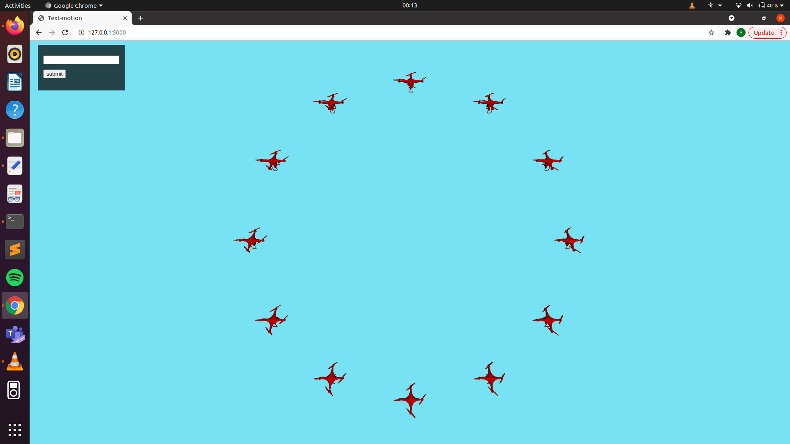

## Text-motion
I got my inspiration from the research paper “From Motions to Emotions: Can the Fundamental Emotions be Expressed in a Robot Swarm? By Maria Santos and Magnus Egerstedt”. The research paper talks about moving a swarm of robots in some particular trajectories for expressing various kinds of emotion. The trajectories for each of the emotions are predefined.
I tried extending the idea a bit by adding emotion prediction from the text inputted and then displaying simulation corresponding to that emotion.
A linear SVM algorithm is used for training the model. This algorithm is efficient for multi-class labelling over large datasets. 
Three JS is used for demonstrating the robot movements. The blender model of a drone is used as the moving object and such 12 drones move in particular trajectories for each emotion. The emotions that have been included are Happiness, Sadness, Anger and Surprise.
 

